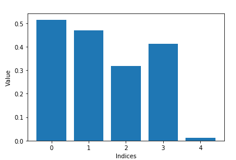
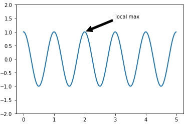
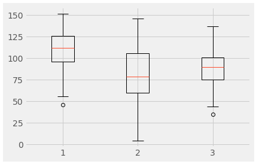
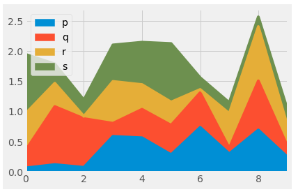
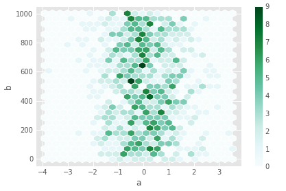
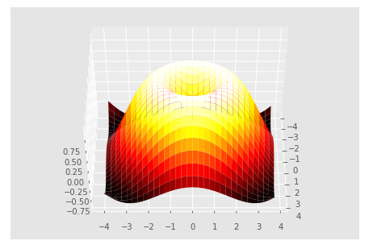

<h1 align="center">

</h1> 

# Data Visualizer

  

This project is a reusable notebook focused on exploring and demonstrating simple methods to visualize data in both 2D and 3D. As a sandbox for experimentation, it includes a range of plotting techniques using Python libraries like Matplotlib and Seaborn, ideal for anyone looking to understand or improve their data visualization skills.
  

## 🔑 Key Feature

### Basic Plotting:

Demonstrates the basics of plotting simple line graphs and adjusting visual properties like line style, width, and color.
  

### Advanced Plotting Techniques:

Explores multiple plots on the same figure, handling subplots, and creating complex layouts.
  

### Interactive Visualizations:

Utilizes Plotly for dynamic, interactive graphs that enhance user engagement and provide deeper insights.
  

### Styling Plots:

Implements various styles to visualize data, adapting the appearance of plots to match preferences or themes like ggplot from R and fivethirtyeight style.
  

### 3D Visualizations:

Showcases 3D plotting capabilities to represent multi-dimensional data, enhancing the perception of depth and trends.
  

## 🧠 Skills
- Python
- Matplotlib, Seaborn, Plotly
- Data Visualization Techniques
- Statistical Data Analysis

## 🦾Future Work
- Incorporate More Interactive Tools: Enhance notebooks with more interactive elements, possibly integrating with web-based visualization tools.
- Expand Dataset Variety: Apply visualization techniques to a broader range of datasets and scenarios to cover more use cases.
- Machine Learning Integration: Utilize visualizations for machine learning model diagnostics to better understand model behaviors and results.

